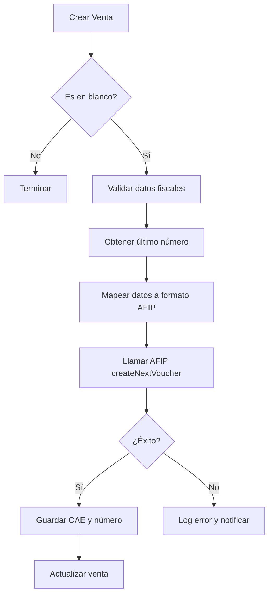

# Plan de Integración AFIP - Sistema BDN Importación

## 🎯 Objetivo
Integrar la facturación electrónica de AFIP con nuestro sistema de ventas existente, permitiendo generar CAE automáticamente para ventas "en blanco".

## 📊 Análisis del Estado Actual

### ✅ **Ya Tenemos:**
- Sistema de ventas funcionando con cálculos fiscales
- Modelo `Sale` con campos AFIP preparados:
  - `invoiceType` (FACTURA_A, FACTURA_B, etc.)
  - `pointOfSale` (punto de venta)
  - `invoiceNumber` (número secuencial)
  - `authCode` (CAE)
  - `authCodeExpiry` (vencimiento CAE)
  - `taxedAmount`, `nonTaxedAmount`, `exemptAmount`
- Clientes con información fiscal (CUIT, tipo de responsable)
- Productos con códigos tributarios y tipos de IVA

### 🔄 **Necesitamos Implementar:**
1. **SDK AFIP** - Integración con la API de AFIP
2. **Mapeo de Datos** - Convertir nuestros datos al formato AFIP
3. **Generación automática de CAE** - Al confirmar ventas "en blanco"
4. **Validaciones fiscales** - Verificar datos antes de enviar a AFIP
5. **Manejo de errores** - Gestión de fallos en AFIP

## 🗺️ **Mapeo de Datos: Sistema BDN → AFIP**

### **Cliente (Customer → AFIP)**
```javascript
// Nuestro sistema → AFIP
{
  // Customer.customerType → DocTipo
  "responsable_inscripto": 80,    // CUIT
  "monotributo": 86,              // CUIL
  "consumidor_final": 99,         // Sin identificar
  "exento": 80,                   // CUIT
  
  // Customer.taxId → DocNro
  taxId: "30-12345678-9" → DocNro: 30123456789
}
```

### **Productos (SaleItem → AFIP)**
```javascript
// IVAType → Id de alícuota AFIP
{
  "iva_0": 3,      // 0%
  "iva_10_5": 4,   // 10.5%
  "iva_21": 5,     // 21%
  "iva_27": 6,     // 27%
  "exento": 2      // Exento
}
```

### **Venta (Sale → AFIP)**
```javascript
const afipData = {
  CantReg: 1,                           // Siempre 1
  PtoVta: parseInt(sale.pointOfSale),   // "0001" → 1
  CbteTipo: getAfipInvoiceType(sale.invoiceType), // FACTURA_B → 6
  Concepto: 1,                          // 1=Productos (siempre)
  DocTipo: getAfipDocType(customer.customerType),
  DocNro: cleanTaxId(customer.taxId),
  CbteDesde: sale.invoiceNumber,
  CbteHasta: sale.invoiceNumber,
  CbteFch: formatDateForAfip(sale.saleDate), // yyyymmdd
  ImpTotal: sale.total,
  ImpTotConc: sale.nonTaxedAmount,
  ImpNeto: sale.taxedAmount,
  ImpOpEx: sale.exemptAmount,
  ImpIVA: sale.taxAmount,
  ImpTrib: sale.grossIncomePerception,
  MonId: 'PES',
  MonCotiz: 1,
  Iva: buildIvaArray(sale.items)
}
```

## 🏗️ **Arquitectura de Implementación**

### **1. Estructura de Archivos**
```
lib/
  afip/
    client.ts          # Cliente AFIP configurado
    mappers.ts         # Funciones de mapeo de datos
    validators.ts      # Validaciones pre-AFIP
    types.ts          # Tipos TypeScript para AFIP
services/
  afip-service.ts     # Servicio principal de AFIP
```

### **2. Flujo de Proceso**


### **3. Puntos de Integración**

#### **API Route: `/api/sales/afip`**
- **POST** - Facturar venta existente en AFIP
- **GET** - Consultar estado de factura en AFIP

#### **Middleware en Sales API**
- Auto-facturación al crear ventas "en blanco" confirmadas
- Validación de datos fiscales obligatorios

#### **Webhook/Callback para errores**
- Reintento automático en caso de fallas temporales
- Notificación a administradores

## 📋 **Plan de Implementación por Fases**

### **Fase 1: Preparación (1-2 días)**
1. ✅ Corregir API de ventas (HECHO)
2. ✅ Instalar y configurar AFIP SDK (HECHO)
3. ✅ Crear mappers básicos de datos (HECHO)
4. ✅ Implementar validaciones fiscales (HECHO)

### **Fase 2: Integración Básica (2-3 días)**
1. ✅ Crear servicio AFIP (HECHO)
2. ✅ Implementar generación de CAE manual (HECHO)
3. ⏳ Testear con datos de prueba (PENDIENTE - Necesita certificados)
4. ✅ Manejo de errores básicos (HECHO)

### **Fase 3: Automatización (1-2 días)**
1. ⏳ Integración automática en API de ventas
2. ⏳ Validaciones en frontend
3. ⏳ UI para mostrar estado de facturación
4. ⏳ Reportes de facturas emitidas

### **Fase 4: Optimización (1 día)**
1. ⏳ Reintentos automáticos
2. ⏳ Cache de tipos AFIP
3. ⏳ Logs y monitoreo
4. ⏳ Documentación para usuarios

## 🔐 **Configuración Requerida**

### **Variables de Entorno**
```env
# AFIP Configuration
AFIP_ENVIRONMENT=testing        # testing | production
AFIP_CUIT=20123456789          # CUIT de la empresa
AFIP_CERT_PATH=./certs/afip.crt # Certificado AFIP
AFIP_KEY_PATH=./certs/afip.key  # Clave privada AFIP
AFIP_PASSPHRASE=secret         # Passphrase del certificado
```

### **Certificados AFIP**
- Generar certificado y clave privada
- Subir certificado a AFIP (testing y producción)
- Configurar alias en AFIP para acceso a Web Services

## 🧪 **Testing Strategy**

### **Datos de Prueba AFIP**
- Usar CUIT de testing: 20123456789
- Punto de venta: 1
- Tipos de comprobante de prueba
- Clientes ficticios con CUIT válidos

### **Casos de Prueba**
1. Factura B a Consumidor Final
2. Factura A a Responsable Inscripto
3. Nota de Crédito
4. Factura con múltiples alícuotas IVA
5. Manejo de errores AFIP

## 📊 **Métricas y Monitoreo**

### **KPIs**
- % de facturas exitosas vs fallidas
- Tiempo promedio de generación CAE
- Errores más frecuentes
- Volumen de facturación diaria

### **Alertas**
- Falla en conexión AFIP
- Error en generación de CAE
- Certificado próximo a vencer
- Límites de facturación alcanzados

## 🚀 **Próximos Pasos Inmediatos**

1. **Instalar AFIP SDK**
2. **Crear estructura de archivos**
3. **Implementar mappers básicos**
4. **Configurar certificados de testing**
5. **Primer test de conexión con AFIP** 